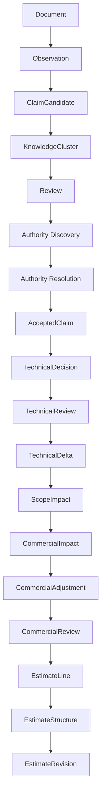

# Decision Pipeline

## Syfte

Beslutspipelinen definierar hur Crow förädlar källmaterial till tekniskt och kommersiellt användbara resultat utan att blanda samman fakta, tolkning, authority och beslut.

## Översikt

## Pipelinekontrakt

Varje steg ska dokumentera:

- accepterad input,
- producerad output,
- tillämpade regler,
- obligatorisk provenance,
- valideringsfel,
- deterministiska sorterings- och fingerprintregler,
- eventuella human-review-grindar.

## Stegens ansvar

### Document → Observation

Document Intelligence bevarar källa och revision. Observation Engine extraherar strukturerade iakttagelser. En observation ska inte uttrycka vilken källa som har företräde.

### Observation → ClaimCandidate

Claim Extraction skapar tolkningar som kan verifieras och jämföras. Ett claim är ännu inte godkänt beslutsunderlag.

### ClaimCandidate → KnowledgeCluster

Knowledge Fusion grupperar semantiskt relaterade claims och identifierar stöd eller konflikt. Klustret ska bevara varje claims individuella provenance.

### KnowledgeCluster → Authority Resolution

Authority Discovery hittar tillämpliga auktoritetsregler. Resolution applicerar projektbunden ordning eller kräver review. Crow får inte anta generell dokumentordning när projektets regler saknas.

### Authority Resolution → AcceptedClaim

Endast claims som uppfyller accepterad authority och review-policy kan övergå till AcceptedClaim.

### AcceptedClaim → TechnicalDecision

Technical Decision Engine använder versionerade regler. Utdata ska innehålla vilka claims och regler som bar beslutet.

### TechnicalDecision → TechnicalDelta

Technical Review godkänner eller avvisar resultatet. Technical Delta jämför ett godkänt beslut med en explicit baseline och uttrycker ändringen strukturerat.

### TechnicalDelta → ScopeImpact

Scope Impact översätter teknisk förändring till mängd, aktivitet eller omfattning. Den ska inte prissätta utan kommersiell regel.

### ScopeImpact → CommercialImpact

Commercial Impact använder prisbok, policy och andra versionerade kommersiella data för att beräkna ekonomisk påverkan.

### CommercialImpact → CommercialReview

Commercial Adjustments är explicita, separata korrigeringar. Commercial Review utgör en godkännandepunkt före kalkylrader skapas.

### CommercialReview → EstimateLine

Estimate Line Foundation skapar atomära rader med mängd, enhet, enhetspris, belopp, justeringar och provenance.

### EstimateLine → EstimateStructure

Grouping profiles placerar varje rad exakt en gång i hierarkin. Sektioner, grupper och totalsummor ska reconcileras mot kalkylens total.

### EstimateStructure → EstimateRevision

Revision Engine jämför strukturerade kalkyler med stabilt `estimate_line_id`. Fältändringar och beloppsdelta redovisas explicit och summeras till total delta.

## Fel- och stoppbeteende

Pipelinen ska stoppa i stället för att gissa när:

- dokumentrevision eller källa saknas,
- claims motsäger varandra utan authority,
- projekt eller baseline inte matchar,
- review saknas,
- valuta eller totalsumma inte kan reconcileras,
- en regelversion inte kan identifieras,
- authorization nekar exekvering.

## Reproduktion

För att reproducera ett resultat krävs minst:

- källartefakternas identiteter och revisioner,
- serialiserade observationer och claims,
- authority-policy och regelversioner,
- reviewbeslut,
- baseline,
- prisbok och kommersiella profiler,
- modul- och kontraktsversioner.
