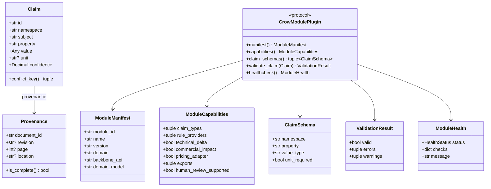
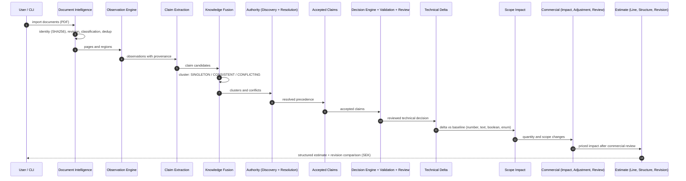
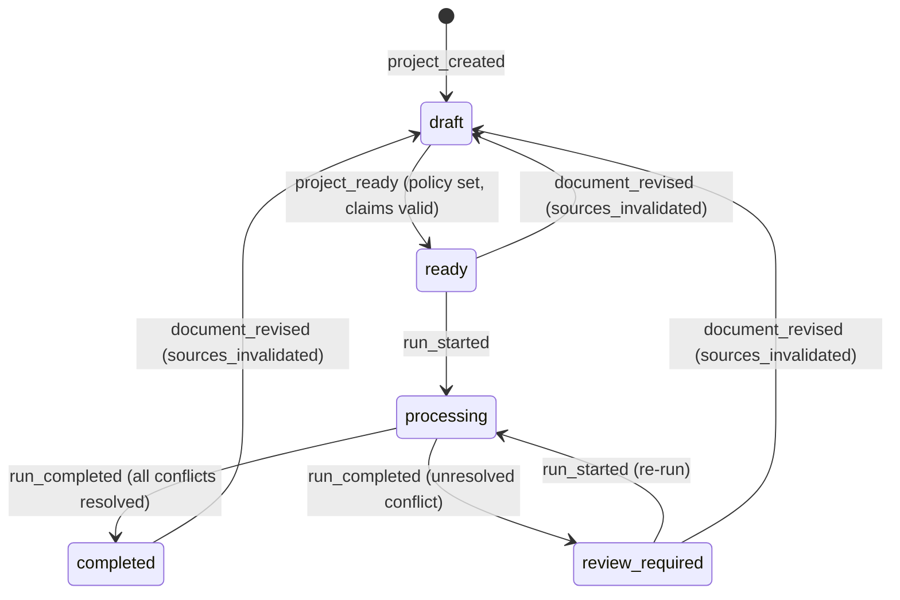

# Diagrams

Code-anchored Mermaid diagrams of the actual system. When code and diagram disagree, the code is right and the diagram has a defect (CAF-002 §6). Complementary flowcharts (system context, data flow) live in `SYSTEM_OVERVIEW.md`.

## 1. SDK core contracts (class model)

Source: `crow_module_sdk/models.py`, `crow_module_sdk/plugin.py`.



## 2. Decision pipeline (sequence)

Source: package chain `crow_document_intelligence` → … → `crow_estimate_revision` (see the package table in `SYSTEM_OVERVIEW.md`).



## 3. Project lifecycle (state machine)

Source: `crow_module_sdk/project.py::ProjectStatus` and the transition rules in `CrowProject`.



Notes anchored in code: a failed run does not produce a failure state — `execute_project_transactionally` rolls the aggregate back to its pre-run state and emits `run_failed` to the audit trail. `ProjectStatus.ARCHIVED` is declared but has no transition method yet; it is intentionally unreachable until an archive operation is added.

## 4. Module lifecycle (sequence)

Source: `crow_module_sdk/module_registry.py` (entry point group `crow.modules`), `crow_module_conformance` (validation, trust), ADR-006.

```mermaid
sequenceDiagram
    autonumber
    participant Dev as Module author
    participant Reg as Module Registry
    participant Conf as Conformance
    participant Trust as Trust Policy
    participant BB as Backbone

    Dev->>Reg: install wheel (entry point crow.modules)
    Reg->>Reg: discover() via importlib entry points
    Reg->>Conf: validate_plugin(plugin)
    Conf->>Conf: manifest, capabilities, schemas, healthcheck
    Conf-->>Reg: ConformanceReport (pass/fail)
    Reg->>Trust: verify signed manifest (HMAC reference; asymmetric per roadmap)
    Trust-->>Reg: trusted / untrusted
    Reg-->>BB: RegisteredModule
    BB->>BB: enforce contracts on every invocation (target: + authorization, ADR-011)
```
