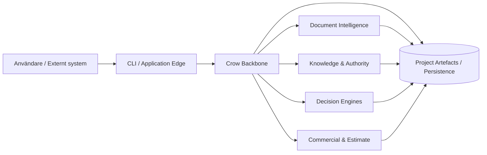
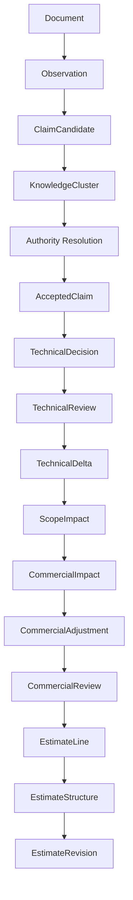

# System Overview

## 1. Översikt

Crow består av en domänneutral plattformskärna och en uppsättning funktionsmoduler. Systemet är idag paketerat som en Python-baserad modulär monolit med CLI, JSON-baserade referensartefakter, publika Python-API:er och automatiserade kvalitetsgrindar.



## 2. Huvudområden

### 2.1 Foundation och projektmodell

Foundation-lagret tillhandahåller projektidentitet, aggregatregler, transaktioner, revision, plugin-kontrakt, conformance och persistenskontrakt. Det är den stabila plattform som senare motorer använder.

### 2.2 Document Intelligence

Document Intelligence registrerar dokument, revisioner och importerade källor. Observation Engine producerar strukturerade observationer med källhänvisning. Claim Extraction omvandlar dessa till kandidater, men kandidater är ännu inte accepterade fakta.

### 2.3 Knowledge och Authority

Knowledge Fusion grupperar claims och synliggör stöd, redundans och konflikter. Authority Discovery identifierar tillämpliga regler. Authority Resolution avgör vilken källa eller regel som har företräde. Accepted Claims är den kontrollerade övergången till beslutsbar kunskap.

### 2.4 Technical Decision

Technical Decision Engine tillämpar explicita och versionerade regler. Technical Validation och Technical Review kontrollerar att beslutet är sammanhängande och granskat. Technical Delta jämför beslutet med en projektbunden baseline.

### 2.5 Scope och Commercial

Scope Impact beskriver förändrad omfattning och mängd. Commercial Impact översätter detta till ekonomisk påverkan. Commercial Adjustments lägger till explicit prissättning eller korrigeringar. Commercial Review är den formella grinden före kalkyl.

### 2.6 Estimate

Estimate Line Foundation skapar atomära kalkylrader. Estimate Structure grupperar rader i sektioner och grupper enligt deterministiska profiler. Estimate Revision jämför två strukturerade kalkyler och redovisar tillagda, borttagna, ändrade och oförändrade rader samt total delta.

## 3. Paketöversikt

| Paket | Primärt ansvar |
|---|---|
| `crow_document_intelligence` | dokumentintag, identitet och revision |
| `crow_observation_engine` | källbundna observationer |
| `crow_claim_extraction` | claim-kandidater |
| `crow_knowledge_fusion` | klustring och konfliktunderlag |
| `crow_authority` | auktoritetsmodeller och regler |
| `crow_authority_discovery` | identifiering av tillämplig authority |
| `crow_accepted_claims` | godkända claims |
| `crow_decision_engine` | tekniska beslut |
| `crow_technical_validation` | teknisk validering |
| `crow_technical_review` | explicit granskning |
| `crow_technical_delta` | jämförelse mot baseline |
| `crow_scope_impact` | mängd- och scopepåverkan |
| `crow_commercial_impact` | ekonomisk påverkan |
| `crow_commercial_adjustment` | explicita kommersiella justeringar |
| `crow_commercial_review` | kommersiell beslutspunkt |
| `crow_estimate_line` | atomära kalkylrader |
| `crow_estimate_structure` | hierarkisk kalkylstruktur |
| `crow_estimate_revision` | revisionsjämförelse |
| `crow_module_sdk` | publika modulkontrakt |
| `crow_module_conformance` | mekanisk kontraktskontroll |

## 4. Dataflöde



Data flyttas inte genom att gamla objekt muteras. Varje steg producerar nya objekt som refererar till sina föregångare genom identiteter, provenance eller fingerprints.

## 5. Exekveringsmönster

En typisk motor är en ren eller nära-ren funktion:

```text
validated input + versioned rules → deterministic output
```

Service-lagret ansvarar för att ladda artefakter, anropa motorn, validera projektkontext och spara resultat. CLI-lagret ska vara tunt och inte duplicera domänlogik.

## 6. Kvalitetsmodell

Den nuvarande koden verifieras genom:

- Ruff,
- Mypy i strict-läge,
- Pytest,
- wheel-build,
- sdist-build,
- modulära integrationsdemonstrationer,
- verifieringsfiler per sprint.

RC0 kompletterar detta med dokumentationsgranskning och arkitekturella fitness functions.

## 7. Deploymentstatus

Den nuvarande referensimplementationen är lokal och filbaserad. Multi-tenant SaaS, OIDC-edge, central authorization och PostgreSQL row-level security är dokumenterad målarkitektur, inte fullt implementerad driftarkitektur. Den distinktionen ska bevaras i alla säkerhetsdokument.

## 8. Systemgräns

Crow ansvarar för beslutens struktur, proveniens och reproducerbarhet. Externa system kan ansvara för:

- identitetsleverans,
- objektlagring,
- meddelandeköer,
- externa prisböcker,
- dokumentkonvertering,
- presentation och rapportgenerering.

Integrationer ska ske genom publika, versionerade kontrakt.
